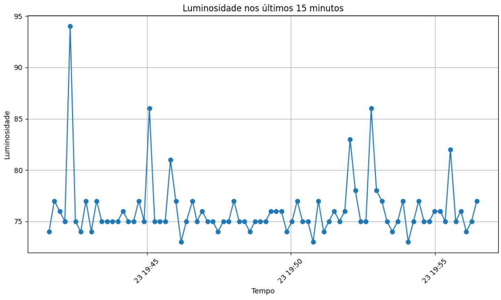

# Edge Computing & Computer Systems

## Case Vinheria Agnello

### Arquitetura de Solução para Coleta de Dados de Vinícola:

#### 1. Dispositivo de Coleta de Dados (ESP32):

O ESP32 será equipado com um atuador buzzer para alertar o cliente e sensores para medir a luminosidade (LDR), umidade e temperatura (DHT11).
Ele coletará dados periodicamente desses sensores. Também receberá instruções fazendo com que o buzzer entre em ação conforme os parâmetros pré estabelecidos pelos sensores.
O ESP32 se conectará a uma rede Wi-Fi para se comunicar com o sistema de back-end (FIWARE Descomplicado) utilizando o protocólo de comunicação MQTT.

#### 2. Sistema de Back-End (Fiware Descomplicado):

O sistema de back-end receberá os dados MQTT do ESP32.
Fiware Descomplicado será usado para processar e armazenar esses dados.
Configurar subsistemas Fiware (Orion Context Broker e STH-Comet) para gerenciar entidades de dados, armazenamento e notificações.
Implementar regras de negócios para processar dados, como alertas com base em valores limites de umidade, temperatura, luminosidade, etc.
Armazenar dados históricos em um banco de dados (por exemplo, MongoDB) para análises posteriores.
#### 3. Camada de Front-End:

A camada de front-end será responsável pela visualização dos dados coletados.
Podendo ser um dashboard ou um aplicativo móvel para que os usuários vejam os dados em tempo real.
APIs disponibilizadas pelo sistema de back-end serão utilizadas para buscar dados e atualizar a interface do usuário.
Será implementado gráficos e visualizações para representar os dados de maneira compreensível pelo usuário.
#### 4. Segurança:

Serão implementadas medidas de segurança, como autenticação e autorização, em todas as camadas da solução para proteger os dados sensíveis.
#### 5. Escalabilidade e Manutenção:

A solução será projetada de forma escalável para lidar com um possível aumento no número de dispositivos ou volume de dados.
Práticas de monitoramento para acompanhar o desempenho da solução e identificar problemas rapidamente.
#### 6. Documentação:

Documente adequadamente a arquitetura, os processos de configuração, manutenção, e as interfaces de API facilitando a gestão e a expansão futura da solução.

## Luminosidade x Tempo (15 minutos de coleta utilizando STH-Comet)

Obs: o gráfico mostra que foram coletadas aproximadamente 82 leituras num período de 15 minutos.

## Autores

1ESPF

- João Lucas Cancado (rm: 551612)
- Murilo Marsola Eloys (rm: 552117)
- Victor Kenzo Toma (rm: 551649)

